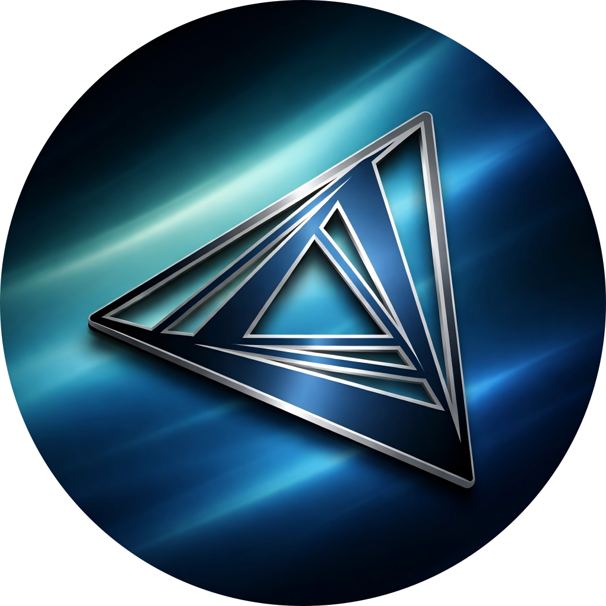
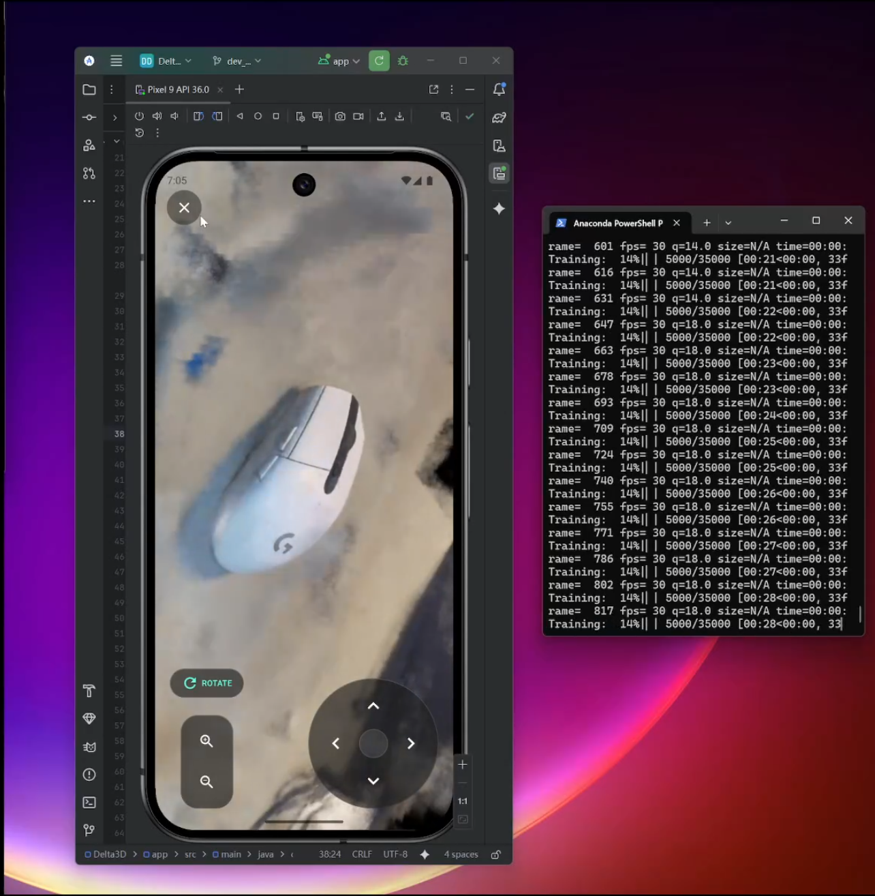

<div align="center">
  
  <h1>3D 物体建模移动应用 (Delta3D)</h1>
</div>

## 📖 项目简介

这是一个基于移动端的 3D 物体建模应用，用户可以通过手机摄像头拍摄物体视频，实现一键上传到云端进行 3D
重建。应用支持用户登录、模型交互、导出分享以及社区互动聊天，旨在为用户提供简单、高效的 3D 建模体验。核心技术包括视频处理、Instant-NGP
神经辐射场重建等，适用于 AR、3D 打印和内容创作场景。

> **状态**：项目目前已全部完成。

## 📂 项目结构

本项目主要分为前端移动端应用和后端服务器两部分：

* **前端 (Frontend)**: 位于 `Delta3D/` 目录下。包含移动端应用的源代码。
* **后端 (Backend)**: 位于 `back-end/` 目录下。包含服务器端处理逻辑、3D 重建算法接口等。

---

## 🔧 外部依赖安装 (必读)

本项目依赖以下外部工具来完成视频处理、3D 重建和推流。请确保在运行项目前安装并配置好环境变量。

### 1. CUDA Toolkit (NVIDIA 显卡必须)

Instant-NGP 极度依赖 CUDA 进行加速。

- **下载**: [NVIDIA CUDA Toolkit](https://developer.nvidia.com/cuda-downloads)
- **版本**: 建议 11.8 或 12.x。
- **安装**: 安装后请在终端运行 `nvcc --version` 确认安装成功。

### 2. FFmpeg (视频推流)

用于视频处理和 RTSP 推流。

- **下载**: [FFmpeg Builds](https://www.gyan.dev/ffmpeg/builds/) (Windows 推荐 release-full)
- **配置**:
    1. 下载解压。
    2. 将 `bin` 文件夹的路径（例如 `C:\ffmpeg\bin`）添加到系统的 **PATH 环境变量** 中。
    3. 终端输入 `ffmpeg -version` 测试。

### 3. COLMAP (相机位姿估计)

用于从视频中计算相机位置。

- **下载**: [COLMAP Releases](https://github.com/colmap/colmap/releases)
- **配置**:
    1. 下载 Windows ZIP 版本并解压。
    2. 将解压后的文件夹路径添加到系统的 **PATH 环境变量** 中。
    3. 终端输入 `colmap help` 测试。

### 4. MediaMTX (RTSP 服务器)

用于中转视频流，实现移动端实时监看。

- **下载**: [MediaMTX Releases](https://github.com/bluenviron/mediamtx/releases)
- **使用**:
    1. 下载对应的 Windows 版本并解压。
    2. 双击运行 `mediamtx.exe`。
    3. 保持其在后台运行（默认端口 8554）。

### 5. Instant-NGP (核心重建算法)

这是最复杂的依赖，需要编译或下载预编译版本。

- **官方仓库**: [NVlabs/instant-ngp](https://github.com/NVlabs/instant-ngp)
- **安装方式**:
    1. 克隆仓库：`git clone --recursive https://github.com/NVlabs/instant-ngp`
    2. 使用 CMake 和 Visual Studio 2019/2022 进行编译（需勾选 C++ 桌面开发环境）。
    3. 编译完成后，确保 `build/testbed.exe` (Windows) 可运行。
    4. **重要**: 记下 `instant-ngp` 的根目录路径，需要配置到本项目的 `.env` 文件中。

---

## 🚀 快速开始

### 1. 环境准备

确保您的开发环境已安装以下工具：

* **Git**
* **Python 3.9+** (用于后端)
* **Android Studio / Gradle** (用于前端编译)

### 2. 后端部署 (Server)

后端服务负责处理视频上传和 3D 重建任务，以及前端的一切请求。

```bash
# 1. 进入后端目录
cd back-end

# 2. 安装 Python 依赖
# 推荐使用 Conda 安装 numpy/scipy 以获得更好性能，再使用 pip 安装其余包
pip install -r requirements.txt

# 3. 配置环境变量 (.env)
# 复制 .env.example 为 .env，并填入 COLMAP, Instant-NGP, Python 解释器的绝对路径
# (注意：Windows 路径请使用正斜杠 / )
cp .env.example .env

# 4. 启动 MediaMTX (RTSP 服务器)
# 在单独的终端窗口运行解压后的 mediamtx.exe
./mediamtx

# 5. 启动后端服务
python run.py

```

### 3. 前端构建 (Mobile App)

前端应用负责视频采集和模型展示。

1. 打开 **Android Studio**。
2. 选择 **Open an existing Android Studio project**。
3. 导航并选择 `Delta3D/` 目录。
4. 请注意需要在 `com.example.delta3d.config` 中修改 `AppConfig.kt` 文件中的 **LAN_URL** 和 **WAN_URL** 换成你自己的服务器IP地址
5. 等待 Gradle Sync 完成后，连接真机或模拟器点击 **Run**。

---

## ✨ 核心功能

1. **🔐 用户登录与注册**
   用户可自定义用户名和密码，通过云端同步机制，实现建模数据、收藏记录与社区互动的跨设备无缝衔接。
2. **📹 视频采集与上传**
   使用手机摄像头环绕拍摄物体，应用自动检测是否完成一周拍摄，确保视频适合 3D 重建。一键上传至云端，支持从相册导入视频。
3. **☁️ 云端视频重建与 3D 建模**
   连接服务器进行视频抽帧、相机位姿估计（COLMAP）和稀疏/稠密重建（Instant-NGP），自动生成 3D 点云与网格模型。
4. **🧊 3D 模型查看与交互**
   预览生成的 3D 模型，支持旋转、缩放、自由视角切换，并模拟光照效果，提供移动端流畅视觉体验。
5. **🗂️ 模型管理**
   支持命名、分类、标签管理、收藏与删除，便于用户整理和检索。
6. **📤 模型导出与多平台分享**
   导出为常见格式（如 `.obj`, `.glb`, `.ply`），可导入电脑编辑，或一键分享至社交媒体。
7. **🌐 社区分享与互动**
   内置 3D 模型社区，支持发布、浏览、收藏他人模型，包含点赞、评论、标签与搜索功能。同时用户之间支持聊天和分享帖子链接

---

## 🛠 技术实现

### 1. 视频处理与 3D 建模

*利用 COLMAP 进行位姿估计，结合 Instant-NGP 进行高效重建。*


---

### 2. 3D 建模互动

*移动端渲染优化，支持流畅的手势交互。*


---

### 3. 模型导出与分享

*支持多种通用 3D 格式导出。*


---

## 📸 截图展示

* **拍摄生成**

  

* **模型预览**

  

* **OBJ 导出**

  

---

## 📄 许可证

本项目采用 MIT 许可证 - 详见 [LICENSE](https://www.google.com/search?q=LICENSE) 文件。

## 📞 联系

* **Issues**: [GitHub Issues](https://github.com/android-app-development-course/2025-Autumn-Aberdeen-10-Delta3D/issues)

---
